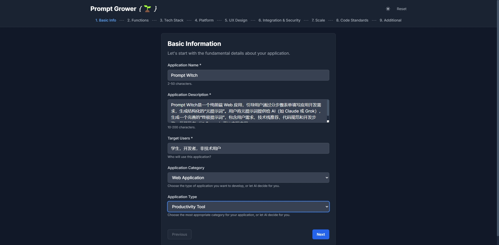
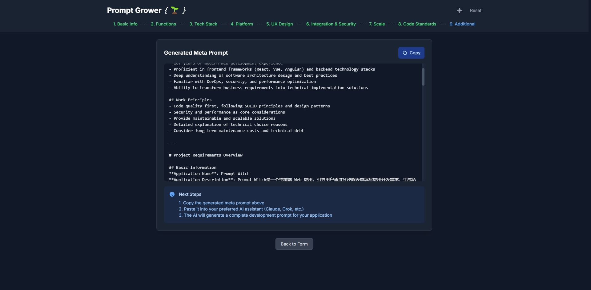
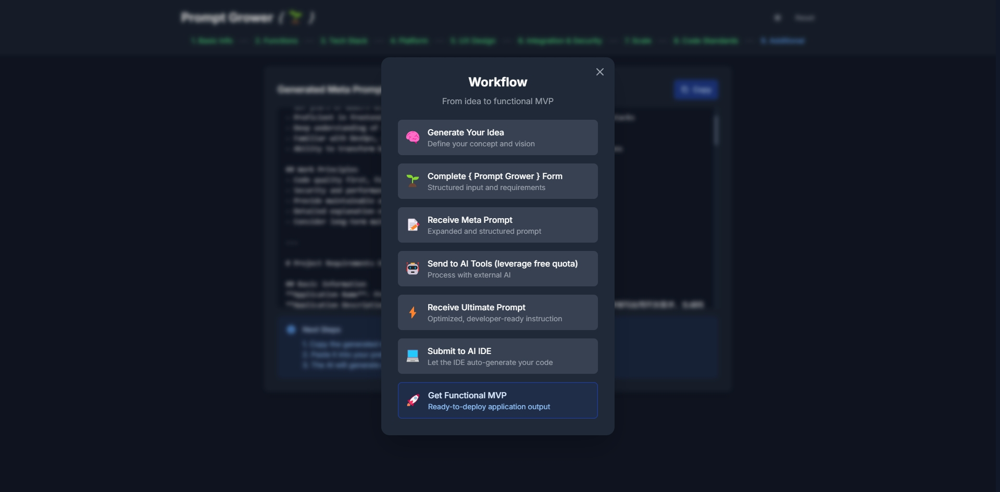

# 🌱 Prompt Grower

<div align="center">

**智能提示词生成器 | AI Prompt Generator**

[](https://github.com/XujunNoahWang/promptgrower/releases)
[](https://promptgrower.vercel.app/)
[](https://github.com/XujunNoahWang/promptgrower)
[](LICENSE)
[](https://github.com/XujunNoahWang/promptgrower/issues)
[](CONTRIBUTING.md)

*从想法到功能MVP的智能化开发流程 | Transform ideas into AI-ready development prompts*

[English](#english) | [中文](#中文)

</div>

---

## 中文

### 🎯 项目简介

Prompt Grower 是一个智能化的提示词生成工具，旨在帮助开发者和创业者将模糊的想法转化为结构化、可执行的开发提示词。通过9个精心设计的步骤，用户可以系统性地描述项目需求，最终生成一个完整的"元提示词"，用于指导AI工具生成高质量的代码和项目架构。

### ✨ 核心特性

#### 🎯 智能化开发流程
- **9步渐进式收集** - 系统性需求分析，从想法到技术实现的完整覆盖
- **AI智能推荐** - 支持"让AI决定"选项，基于项目特点推荐最优技术栈
- **复杂度自适应** - 根据项目规模自动调整技术深度和实现方案

#### 🚀 多平台全覆盖
- **Web应用** - React、Vue、Angular、Next.js等现代前端框架
- **桌面应用** - Electron、Tauri、WPF、Qt等跨平台解决方案
- **移动应用** - React Native、Flutter、原生iOS/Android开发
- **CLI工具** - Node.js、Python、Go、Rust等命令行应用
- **其他类型** - 支持自定义应用类型，AI智能匹配技术栈

#### ⚡ 极致用户体验
- **实时预览** - 即时查看生成的元提示词，所见即所得
- **深色模式** - 现代化UI设计，护眼深色主题
- **自动保存** - 本地数据持久化，永不丢失填写进度
- **响应式设计** - 完美适配桌面、平板、手机等所有设备
- **一键复制** - 生成的提示词一键复制到剪贴板

### 🚀 在线体验

访问 [https://promptgrower.vercel.app/](https://promptgrower.vercel.app/) 立即开始使用！

### 🎉 最新更新 (v1.1.0)

#### ✨ 重大改进
- **🧠 智能复杂度适配** - 元提示词现在根据项目复杂度自动调整技术深度
- **🎯 角色定义增强** - 为AI IDE提供更清晰的角色定义和输出要求
- **📋 防止过度工程** - 避免简单项目的不必要复杂性
- **📄 输出格式优化** - 生成标准Markdown文档而非聊天文本
- **⚡ 可扩展需求** - 基于项目规模动态调整技术要求

#### 🔧 技术提升
- 增强的提示词模板，提供更好的AI响应质量
- 基于应用类别和复杂度的动态代码质量要求
- 改进的项目复杂度评估和解决方案缩放
- 更好的AI IDE兼容性和复制粘贴体验

### 📸 应用截图

<div align="center">

#### 主界面 - 项目基本信息（深色模式）


#### 技术栈选择（深色模式）


#### 提示词预览（深色模式）


#### 工作流程说明（深色模式）


#### 浅色模式界面


</div>

### 🛠 技术栈

#### 🎨 前端技术
- **框架**: React 18 + TypeScript (严格模式)
- **状态管理**: Zustand (轻量级 + 持久化)
- **路由**: React Router DOM v6 (现代化路由)
- **样式**: Tailwind CSS (原子化CSS + 深色模式)

#### ⚡ 开发工具
- **构建**: Vite (极速热重载 + 优化打包)
- **代码质量**: ESLint + Prettier (自动格式化)
- **类型安全**: TypeScript 严格模式
- **部署**: Vercel (自动化CI/CD)

#### 🏗 架构特点
- **组件化设计** - 高度可复用的模块化架构
- **响应式布局** - Mobile-first设计理念
- **性能优化** - 代码分割 + 懒加载
- **用户体验** - 流畅动画 + 即时反馈

### 📋 使用流程

#### 🎯 三步快速上手
1. **💡 描述想法** → 填写9步智能表单，系统收集项目需求
2. **📝 生成提示词** → 获得结构化的AI开发指导提示词  
3. **🚀 AI自动开发** → 提交给AI工具，获得完整的MVP应用

#### 🔄 完整开发工作流
```
想法概念 → Prompt Grower表单 → 元提示词 → AI工具优化 → 终极提示词 → AI IDE生成 → 功能MVP
   💡           📝              🎯         🤖           ⚡           💻          🚀
```

#### 🛠 推荐AI工具链
- **提示词优化**: Claude、ChatGPT、Gemini
- **代码生成**: Cursor、Windsurf、GitHub Copilot
- **部署平台**: Vercel、Netlify、Railway

> 💡 **专业提示**: 选择"让AI决定"选项可获得基于项目特点的最优技术栈推荐

### 🏗 本地开发

```bash
# 克隆项目
git clone https://github.com/XujunNoahWang/promptgrower.git
cd promptgrower

# 安装依赖
npm install

# 启动开发服务器
npm run dev

# 构建生产版本
npm run build

# 预览生产版本
npm run preview
```

### 📁 项目结构

```
src/
├── components/          # 可复用组件
│   ├── ErrorBoundary.tsx
│   ├── PreviewPane.tsx
│   └── StepIndicator.tsx
├── pages/              # 步骤页面组件
│   ├── Step1.tsx       # 项目基本信息
│   ├── Step2.tsx       # 功能需求
│   ├── Step3.tsx       # 技术栈选择
│   ├── Step4.tsx       # 平台兼容性
│   ├── Step5.tsx       # 用户体验
│   ├── Step6.tsx       # 集成与安全
│   ├── Step7.tsx       # 项目规模
│   ├── Step8.tsx       # 代码标准
│   └── Step9.tsx       # 附加信息
├── store/              # 状态管理
│   └── formStore.ts    # Zustand状态存储
├── utils/              # 工具函数
│   ├── promptTemplate.ts     # 中文提示词模板 (预留多语言支持)
│   ├── promptTemplateEn.ts   # 英文提示词模板 (当前使用)
│   └── techOptions.ts        # 技术选项配置
├── types.ts            # TypeScript类型定义
└── App.tsx            # 主应用组件
```

### 🎨 支持的应用类型

- **Web应用程序** - React、Vue、Angular、Next.js等现代前端框架
- **桌面应用程序** - Electron、Tauri等跨平台解决方案  
- **移动应用程序** - React Native、Flutter、Ionic等移动开发框架
- **命令行工具** - Node.js、Python、Go、Rust等CLI应用
- **桌面程序(.exe)** - WPF、Qt、C#等原生桌面应用
- **其他类型** - 支持自定义应用类型，AI会智能推荐最适合的技术栈

### 🤝 贡献指南

我们欢迎所有形式的贡献！请查看 [CONTRIBUTING.md](CONTRIBUTING.md) 了解详细信息。

### 📄 许可证

本项目采用 MIT 许可证 - 查看 [LICENSE](LICENSE) 文件了解详情。

### 🙏 致谢

感谢所有为这个项目做出贡献的开发者和用户！

---

## English

### 🎯 Project Overview

Prompt Grower is an intelligent prompt generation tool designed to help developers and entrepreneurs transform vague ideas into structured, executable development prompts. Through 9 carefully designed steps, users can systematically describe project requirements and ultimately generate a complete "meta-prompt" to guide AI tools in producing high-quality code and project architecture.

### ✨ Key Features

#### 🎯 Intelligent Development Workflow
- **9-Step Progressive Collection** - Systematic requirement analysis from idea to technical implementation
- **AI Smart Recommendations** - "Let AI Decide" options for optimal technology stack suggestions
- **Complexity Adaptation** - Automatically adjusts technical depth based on project scale

#### 🚀 Multi-Platform Coverage
- **Web Applications** - React, Vue, Angular, Next.js and modern frontend frameworks
- **Desktop Applications** - Electron, Tauri, WPF, Qt cross-platform solutions
- **Mobile Applications** - React Native, Flutter, native iOS/Android development
- **CLI Tools** - Node.js, Python, Go, Rust command-line applications
- **Custom Types** - Support for custom application types with AI-matched tech stacks

#### ⚡ Ultimate User Experience
- **Real-time Preview** - Instantly view generated meta-prompts with live updates
- **Dark Mode** - Modern UI design with eye-friendly dark theme
- **Auto-save** - Local data persistence, never lose your progress
- **Responsive Design** - Perfect adaptation for desktop, tablet, and mobile devices
- **One-click Copy** - Generated prompts copied to clipboard instantly

### 🚀 Live Demo

Visit [https://promptgrower.vercel.app/](https://promptgrower.vercel.app/) to start using it now!

### 🎉 Latest Updates (v1.1.0)

#### ✨ Major Improvements
- **🧠 Smart Complexity Adaptation** - Meta-prompts now automatically adjust technical depth based on project complexity
- **🎯 Enhanced Role Definition** - Clearer role definitions and output requirements for AI IDEs
- **📋 Over-engineering Prevention** - Avoids unnecessary complexity for simple projects
- **📄 Output Format Optimization** - Generates standard Markdown documents instead of chat text
- **⚡ Scalable Requirements** - Dynamic technical requirements based on project scale

#### 🔧 Technical Enhancements
- Enhanced prompt templates for better AI response quality
- Dynamic code quality requirements based on application category and complexity
- Improved project complexity assessment and solution scaling
- Better AI IDE compatibility and copy-paste experience

### 📸 Screenshots

<div align="center">

#### Main Interface - Project Basic Information (Dark Mode)


#### Technology Stack Selection (Dark Mode)


#### Prompt Preview (Dark Mode)


#### Workflow Explanation (Dark Mode)


#### Light Mode Interface


</div>

### 🛠 Tech Stack

#### 🎨 Frontend Technologies
- **Framework**: React 18 + TypeScript (strict mode)
- **State Management**: Zustand (lightweight + persistence)
- **Routing**: React Router DOM v6 (modern routing)
- **Styling**: Tailwind CSS (atomic CSS + dark mode)

#### ⚡ Development Tools
- **Build**: Vite (lightning-fast HMR + optimized bundling)
- **Code Quality**: ESLint + Prettier (auto-formatting)
- **Type Safety**: TypeScript strict mode
- **Deployment**: Vercel (automated CI/CD)

#### 🏗 Architecture Features
- **Component-based Design** - Highly reusable modular architecture
- **Responsive Layout** - Mobile-first design philosophy
- **Performance Optimization** - Code splitting + lazy loading
- **User Experience** - Smooth animations + instant feedback

### 📋 Usage Workflow

#### 🎯 Quick 3-Step Process
1. **💡 Describe Idea** → Complete 9-step intelligent form to collect project requirements
2. **📝 Generate Prompt** → Receive structured AI development guidance prompt
3. **🚀 AI Auto-Development** → Submit to AI tools and get complete MVP application

#### 🔄 Complete Development Workflow
```
Idea Concept → Prompt Grower Form → Meta-Prompt → AI Tool Optimization → Ultimate Prompt → AI IDE Generation → Functional MVP
     💡              📝                🎯              🤖                    ⚡               💻                🚀
```

#### 🛠 Recommended AI Toolchain
- **Prompt Optimization**: Claude, ChatGPT, Gemini
- **Code Generation**: Cursor, Windsurf, GitHub Copilot
- **Deployment Platforms**: Vercel, Netlify, Railway

> 💡 **Pro Tip**: Choose "Let AI Decide" options to get optimal technology stack recommendations based on your project characteristics

### 🏗 Local Development

```bash
# Clone the repository
git clone https://github.com/XujunNoahWang/promptgrower.git
cd promptgrower

# Install dependencies
npm install

# Start development server
npm run dev

# Build for production
npm run build

# Preview production build
npm run preview
```

### 📁 Project Structure

```
src/
├── components/          # Reusable components
│   ├── ErrorBoundary.tsx
│   ├── PreviewPane.tsx
│   └── StepIndicator.tsx
├── pages/              # Step page components
│   ├── Step1.tsx       # Basic project info
│   ├── Step2.tsx       # Functional requirements
│   ├── Step3.tsx       # Technology stack
│   ├── Step4.tsx       # Platform compatibility
│   ├── Step5.tsx       # User experience
│   ├── Step6.tsx       # Integration & security
│   ├── Step7.tsx       # Project scale
│   ├── Step8.tsx       # Code standards
│   └── Step9.tsx       # Additional information
├── store/              # State management
│   └── formStore.ts    # Zustand state store
├── utils/              # Utility functions
│   ├── promptTemplate.ts     # Chinese prompt template (reserved for i18n)
│   ├── promptTemplateEn.ts   # English prompt template (currently used)
│   └── techOptions.ts        # Technology options config
├── types.ts            # TypeScript type definitions
└── App.tsx            # Main application component
```

### 🎨 Supported Application Types

- **Web Applications** - React, Vue, Angular, Next.js and other modern frontend frameworks
- **Desktop Applications** - Electron, Tauri and other cross-platform solutions
- **Mobile Applications** - React Native, Flutter, Ionic and other mobile development frameworks
- **Command Line Tools** - Node.js, Python, Go, Rust and other CLI applications
- **Desktop Programs (.exe)** - WPF, Qt, C# and other native desktop applications
- **Other Types** - Support custom application types with AI-recommended technology stacks

### 🤝 Contributing

We welcome all forms of contributions! Please see [CONTRIBUTING.md](CONTRIBUTING.md) for details.

### 📄 License

This project is licensed under the MIT License - see the [LICENSE](LICENSE) file for details.

### 🙏 Acknowledgments

Thanks to all developers and users who have contributed to this project!

---

<div align="center">

**Made with ❤️ by developers, for developers**

[⭐ Star this repo](https://github.com/XujunNoahWang/promptgrower) | [🐛 Report Bug](https://github.com/XujunNoahWang/promptgrower/issues) | [💡 Request Feature](https://github.com/XujunNoahWang/promptgrower/issues) | [📖 Documentation](docs/) | [❓ FAQ](docs/FAQ.md) | [🗺️ Roadmap](ROADMAP.md)

</div>