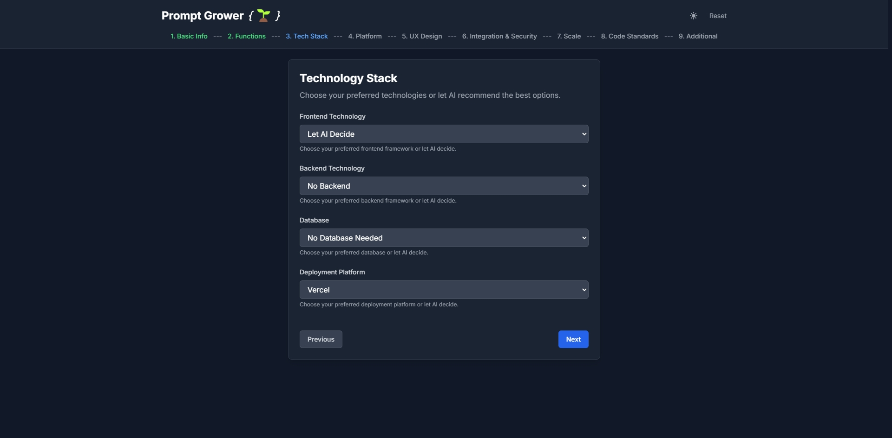

# 🌱 Prompt Grower

<div align="center">

**智能提示词生成器 | AI Prompt Generator**

[](https://promptgrower.vercel.app/)
[](https://github.com/XujunNoahWang/promptgrower)
[](LICENSE)
[](https://github.com/XujunNoahWang/promptgrower/issues)
[](https://github.com/XujunNoahWang/promptgrower/fork)
[](CONTRIBUTING.md)

*从想法到功能MVP的智能化开发流程*

[English](#english) | [中文](#中文)

</div>

---

## 中文

### 🎯 项目简介

Prompt Grower 是一个智能化的提示词生成工具，旨在帮助开发者和创业者将模糊的想法转化为结构化、可执行的开发提示词。通过9个精心设计的步骤，用户可以系统性地描述项目需求，最终生成一个完整的"元提示词"，用于指导AI工具生成高质量的代码和项目架构。

### ✨ 核心特性

- **🧠 智能化表单设计** - 9步渐进式需求收集，覆盖项目全生命周期
- **🎨 多应用类型支持** - Web应用、桌面程序、移动应用、CLI工具等
- **⚡ 实时预览生成** - 即时查看生成的元提示词效果
- **🌙 深色模式支持** - 现代化UI设计，支持明暗主题切换
- **💾 本地数据持久化** - 自动保存填写进度，避免数据丢失
- **📱 响应式设计** - 完美适配桌面端和移动端
- **🔄 工作流程可视化** - 清晰展示从想法到MVP的完整流程

### 🚀 在线体验

访问 [https://promptgrower.vercel.app/](https://promptgrower.vercel.app/) 立即开始使用！

### 📸 应用截图

<div align="center">

#### 主界面 - 项目基本信息（深色模式）


#### 技术栈选择（深色模式）


#### 提示词预览（深色模式）


#### 工作流程说明（深色模式）


#### 浅色模式界面


</div>

### 🛠 技术栈

- **前端框架**: React 18 + TypeScript
- **状态管理**: Zustand
- **路由管理**: React Router DOM
- **样式方案**: Tailwind CSS
- **构建工具**: Vite
- **部署平台**: Vercel

### 📋 使用流程

1. **💡 准备你的想法** - 明确你想要开发的应用概念
2. **📝 填写9步表单** - 系统性描述项目需求和技术偏好
3. **🎯 获取元提示词** - 生成结构化的开发指导提示词
4. **🤖 提交给AI工具** - 将元提示词发送给Claude、ChatGPT等AI工具
5. **⚡ 接收终极提示词** - 获得优化后的、开发就绪的详细指令
6. **💻 AI IDE自动生成** - 在Cursor、Windsurf等AI IDE中自动生成代码
7. **🚀 获得功能MVP** - 得到可部署的应用程序

### 🏗 本地开发

```bash
# 克隆项目
git clone https://github.com/XujunNoahWang/promptgrower.git
cd promptgrower

# 安装依赖
npm install

# 启动开发服务器
npm run dev

# 构建生产版本
npm run build

# 预览生产版本
npm run preview
```

### 📁 项目结构

```
src/
├── components/          # 可复用组件
│   ├── ErrorBoundary.tsx
│   ├── PreviewPane.tsx
│   └── StepIndicator.tsx
├── pages/              # 步骤页面组件
│   ├── Step1.tsx       # 项目基本信息
│   ├── Step2.tsx       # 功能需求
│   ├── Step3.tsx       # 技术栈选择
│   ├── Step4.tsx       # 平台兼容性
│   ├── Step5.tsx       # 用户体验
│   ├── Step6.tsx       # 集成与安全
│   ├── Step7.tsx       # 项目规模
│   ├── Step8.tsx       # 代码标准
│   └── Step9.tsx       # 附加信息
├── store/              # 状态管理
│   └── formStore.ts    # Zustand状态存储
├── utils/              # 工具函数
│   ├── promptTemplate.ts     # 中文提示词模板
│   ├── promptTemplateEn.ts   # 英文提示词模板
│   └── techOptions.ts        # 技术选项配置
├── types.ts            # TypeScript类型定义
└── App.tsx            # 主应用组件
```

### 🎨 支持的应用类型

- **Web应用程序** - React、Vue、Angular等现代前端框架
- **桌面应用程序** - Electron、Tauri等跨平台解决方案  
- **移动应用程序** - React Native、Flutter等移动开发框架
- **命令行工具** - Node.js、Python、Go等CLI应用
- **桌面程序** - WPF、Qt等原生桌面应用

### 🤝 贡献指南

我们欢迎所有形式的贡献！请查看 [CONTRIBUTING.md](CONTRIBUTING.md) 了解详细信息。

### 📄 许可证

本项目采用 MIT 许可证 - 查看 [LICENSE](LICENSE) 文件了解详情。

### 🙏 致谢

感谢所有为这个项目做出贡献的开发者和用户！

---

## English

### 🎯 Project Overview

Prompt Grower is an intelligent prompt generation tool designed to help developers and entrepreneurs transform vague ideas into structured, executable development prompts. Through 9 carefully designed steps, users can systematically describe project requirements and ultimately generate a complete "meta-prompt" to guide AI tools in producing high-quality code and project architecture.

### ✨ Key Features

- **🧠 Intelligent Form Design** - 9-step progressive requirement collection covering the entire project lifecycle
- **🎨 Multi-Application Support** - Web apps, desktop programs, mobile apps, CLI tools, and more
- **⚡ Real-time Preview** - Instantly view generated meta-prompt effects
- **🌙 Dark Mode Support** - Modern UI design with light/dark theme toggle
- **💾 Local Data Persistence** - Auto-save progress to prevent data loss
- **📱 Responsive Design** - Perfect adaptation for desktop and mobile
- **🔄 Workflow Visualization** - Clear display of the complete idea-to-MVP process

### 🚀 Live Demo

Visit [https://promptgrower.vercel.app/](https://promptgrower.vercel.app/) to start using it now!

### 📸 Screenshots

<div align="center">

#### Main Interface - Project Basic Information (Dark Mode)


#### Technology Stack Selection (Dark Mode)


#### Prompt Preview (Dark Mode)


#### Workflow Explanation (Dark Mode)


#### Light Mode Interface


</div>

### 🛠 Tech Stack

- **Frontend Framework**: React 18 + TypeScript
- **State Management**: Zustand
- **Routing**: React Router DOM
- **Styling**: Tailwind CSS
- **Build Tool**: Vite
- **Deployment**: Vercel

### 📋 Usage Workflow

1. **💡 Prepare Your Idea** - Clarify your application concept
2. **📝 Complete 9-Step Form** - Systematically describe project requirements and tech preferences
3. **🎯 Get Meta-Prompt** - Generate structured development guidance prompt
4. **🤖 Submit to AI Tools** - Send meta-prompt to Claude, ChatGPT, or other AI tools
5. **⚡ Receive Ultimate Prompt** - Get optimized, development-ready detailed instructions
6. **💻 AI IDE Auto-Generation** - Auto-generate code in Cursor, Windsurf, or other AI IDEs
7. **🚀 Get Functional MVP** - Obtain deployable application

### 🏗 Local Development

```bash
# Clone the repository
git clone https://github.com/XujunNoahWang/promptgrower.git
cd promptgrower

# Install dependencies
npm install

# Start development server
npm run dev

# Build for production
npm run build

# Preview production build
npm run preview
```

### 📁 Project Structure

```
src/
├── components/          # Reusable components
│   ├── ErrorBoundary.tsx
│   ├── PreviewPane.tsx
│   └── StepIndicator.tsx
├── pages/              # Step page components
│   ├── Step1.tsx       # Basic project info
│   ├── Step2.tsx       # Functional requirements
│   ├── Step3.tsx       # Technology stack
│   ├── Step4.tsx       # Platform compatibility
│   ├── Step5.tsx       # User experience
│   ├── Step6.tsx       # Integration & security
│   ├── Step7.tsx       # Project scale
│   ├── Step8.tsx       # Code standards
│   └── Step9.tsx       # Additional information
├── store/              # State management
│   └── formStore.ts    # Zustand state store
├── utils/              # Utility functions
│   ├── promptTemplate.ts     # Chinese prompt template
│   ├── promptTemplateEn.ts   # English prompt template
│   └── techOptions.ts        # Technology options config
├── types.ts            # TypeScript type definitions
└── App.tsx            # Main application component
```

### 🎨 Supported Application Types

- **Web Applications** - React, Vue, Angular and other modern frontend frameworks
- **Desktop Applications** - Electron, Tauri and other cross-platform solutions
- **Mobile Applications** - React Native, Flutter and other mobile development frameworks
- **Command Line Tools** - Node.js, Python, Go and other CLI applications
- **Desktop Programs** - WPF, Qt and other native desktop applications

### 🤝 Contributing

We welcome all forms of contributions! Please see [CONTRIBUTING.md](CONTRIBUTING.md) for details.

### 📄 License

This project is licensed under the MIT License - see the [LICENSE](LICENSE) file for details.

### 🙏 Acknowledgments

Thanks to all developers and users who have contributed to this project!

---

<div align="center">

**Made with ❤️ by developers, for developers**

[⭐ Star this repo](https://github.com/XujunNoahWang/promptgrower) | [🐛 Report Bug](https://github.com/XujunNoahWang/promptgrower/issues) | [💡 Request Feature](https://github.com/XujunNoahWang/promptgrower/issues)| [📖 Documentation](docs/) | [❓ FAQ](docs/FAQ.md) | [🗺️ Roadmap](ROADMAP.md)

</div>